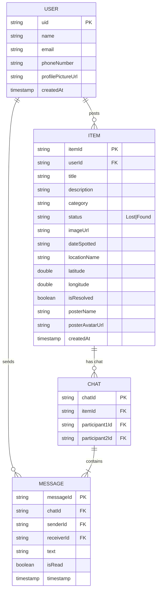

# TraceIt - Lost & Found Mobile App

TraceIt is an Android-based Lost & Found tracking application developed as part of Mobile App Development (MAD) coursework. It enables users to report lost or found items, search listings, view item details with maps, and communicate via in-app chat. The app leverages Firebase for real-time backend services.

## 📋 Table of Contents
- [Project Overview](#project-overview)
- [Features](#features)
- [Tech Stack & Dependencies](#tech-stack--dependencies)
- [Project Structure](#project-structure)
- [Data Models & ER Diagram](#data-models--er-diagram)
- [UI Layouts & Screens](#ui-layouts--screens)
- [Architecture](#architecture)
- [Setup & Build Instructions](#setup--build-instructions)
- [Firebase Configuration](#firebase-configuration)
- [Screenshots / Layouts](#screenshots--layouts)
- [Future Enhancements](#future-enhancements)
- [Contributors](#contributors)

## Project Overview
- **App Name**: TraceIt
- **Package**: `com.lostandfound` (applicationId: `com.trinoka.traceit`)
- **Type**: Native Android (Java)
- **Target**: Android 8.0+ (API 26+)
- **Purpose**: Community-driven lost and found platform with location awareness and real-time chat.

## Features
- User authentication (Email/Password + Google Sign-In)
- Report Lost or Found items with photo, category, location (GPS), description
- Browse home feed of recent posts (Lost/Found)
- Filter by category, status, resolved state
- Item detail view with map pin and contact poster
- Real-time chat between item poster and interested users
- Profile management (avatar upload, posts history)
- My Posts section to manage own listings and mark as resolved
- Pull-to-refresh, image loading with Glide, smooth animations

## Tech Stack & Dependencies
- **Language**: Java 11
- **UI**: ViewBinding, Material Design, ConstraintLayout, SwipeRefreshLayout, CircleImageView
- **Backend**: Firebase
  - Authentication
  - Firestore (NoSQL DB)
  - Cloud Storage (images)
  - Analytics
- **Location**: Google Play Services Location
- **Images**: Glide
- **Build**: Gradle (Android Gradle Plugin), version catalogs (`libs.versions.toml`)
- **Min SDK**: 26 | **Target SDK**: 36 | **Compile SDK**: 36

Key libraries from `app/build.gradle`:
```groovy
firebase-bom, firebase-auth, firebase-firestore, firebase-storage
glide, circleimageview, swiperefreshlayout
play-services-location, play-services-auth
```

## Project Structure
```
TraceIt/
├── app/
│   ├── src/main/
│   │   ├── java/com/lostandfound/
│   │   │   ├── activities/          # Splash, Login, SignUp, Main, AddPost, ItemDetail, Chat
│   │   │   ├── fragments/           # HomeFragment, MyPostsFragment, ProfileFragment
│   │   │   ├── adapters/            # ItemAdapter, MessageAdapter
│   │   │   ├── models/              # Item, User, Message
│   │   │   └── utils/               # FirebaseHelper, Constants, ImageUtils, ValidationUtils
│   │   ├── res/
│   │   │   ├── layout/              # XML layouts for all screens
│   │   │   ├── drawable/            # Backgrounds, badges, chat bubbles
│   │   │   ├── anim/                # Slide & fade animations
│   │   │   └── values/              # strings, colors, themes
│   │   └── AndroidManifest.xml
│   └── build.gradle
├── build.gradle
├── settings.gradle
├── my_flutterapp/                   # Optional Flutter experiment
├── my_app/                          # Additional experiment folder
└── README.md
```

## Data Models & ER Diagram

### Core Collections (Firestore)
- `users/{uid}` → User profile
- `items/{itemId}` → Lost/Found postings
- `chats/{chatId}` → Chat sessions between users for an item
- `chats/{chatId}/messages/{messageId}` → Individual chat messages

### ER Diagram (Mermaid)


**Relationships**:
- One User can post many Items
- One Item can initiate one Chat session
- One Chat contains many Messages (between two Users)

## UI Layouts & Screens
- **SplashActivity**: App logo + loading animation
- **LoginActivity** / **SignUpActivity**: Auth forms + Google button
- **MainActivity**: BottomNavigationView hosting 3 fragments
  - HomeFragment: RecyclerView feed + search/filter chips
  - MyPostsFragment: User's own items with edit/resolve actions
  - ProfileFragment: Avatar, info, logout
- **AddPostActivity**: Form with image picker (camera/gallery), location picker, category spinner, Lost/Found toggle
- **ItemDetailActivity**: Full item card + map preview + "Chat with Poster" button
- **ChatActivity**: Real-time messaging UI with sent/received bubbles

Animations: slide_in/out left/right, slide_up for dialogs.

## Architecture
- **MVVM-ish** (no ViewModel yet – activities/fragments handle logic)
- **Repository pattern** via `FirebaseHelper` singleton
- **Adapter pattern** for RecyclerViews
- **ViewBinding** everywhere (no findViewById)
- Real-time listeners on Firestore snapshots for feed & chat
- Location permission handling + reverse geocoding for address

## Setup & Build Instructions
1. Clone the repo
2. Open in Android Studio (Hedgehog+ recommended)
3. Sync Gradle
4. Run on emulator or device (API 26+)

```bash
./gradlew assembleDebug
```

## Firebase Configuration
- `google-services.json` is present in `app/`
- Required services enabled in Firebase Console:
  - Authentication (Email + Google)
  - Firestore Database (rules: allow authenticated reads/writes on own data)
  - Storage (item_images/ and profile_avatars/ folders)
- Update `default_web_client_id` in `strings.xml` with your OAuth 2.0 Web Client ID

## Screenshots / Layouts

### Splash Screen


### Login & SignUp


### Home Feed


### Add Post


### Item Detail + Map


### Chat Screen


### Profile


> Place actual screenshots under `docs/screenshots/` (PNG/JPG) after capturing from emulator/device.

## Future Enhancements
- Push notifications for new matches/chat
- Advanced search & map clustering
- Item expiry / auto-archive
- Admin moderation dashboard
- Offline support with Room
- Dark theme
- Multi-language support

## Contributors
- Developed as part of MAD course project
- Package originally `com.trinoka.traceit`

---

**TraceIt** – Helping communities reunite lost items with their owners. 🕵️‍♂️📍
